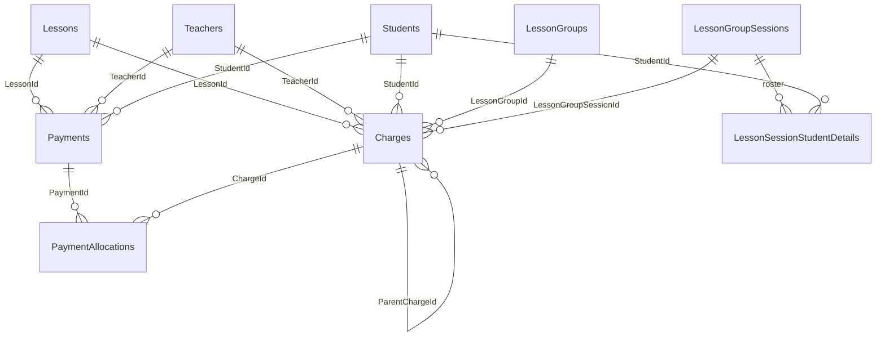
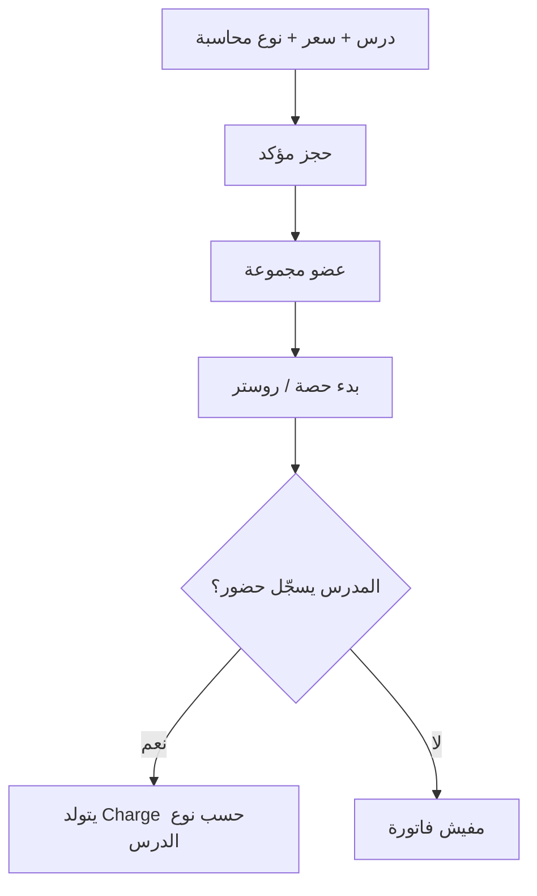

# المحاسبة في Academy — من الحضور إلى القبض

المحاسبة عندنا **دفتر حساب لكل طالب داخل درس معيّن** (مش محفظة عامة، ومفيش رصيد مقدم يتحسب بعدين).

- **الفاتورة / الاستحقاق** = صف في `Charges` (مدين على الطالب).
- **القبض** = صف في `Payments` (دائن سجّله المدرس).
- **الربط** = صفوف في `PaymentAllocations` (الدفعة تتوزع على فاتورة أو أكتر).
- **الحضور** يعيش في `LessonSessionStudentDetails` ومش بيتخزن فيه فلوس.

المتبقّي على فاتورة = `Amount - AllocatedAmount`  
(والـ `AllocatedAmount` لازم يساوي مجموع `PaymentAllocations` على نفس الفاتورة).

---

## 1. الجداول والعلاقات

### 1.1 إعداد الدرس (مش فاتورة، بس بيحدّد شكل الفاتورة)

**`Lessons`**

| العمود | المعنى |
|---|---|
| `BillingType` | `PerSession = 1` أو `Monthly = 2` |
| `SessionPrice` | سعر الحصة (مطلوب لمسار بالحصة + تعويض بالحصة) |
| `MonthlyPrice` | سعر الدورة الشهرية |
| `ChargeAbsentSessions` | بالحصة فقط: لو `true` الغياب برضو بيولّد فاتورة حصة |

العلاقة: درس واحد → مدرس واحد (`TeacherId`).  
الطالب يدخل الدرس عبر **`LessonBookings`** (حالة `Confirmed`) وغالباً يتوزع على **`LessonGroups` / `LessonGroupMembers`**.

### 1.2 الحضور (من غير فلوس)

**`LessonGroupSessions`**  
حصة فعلية (من الجدول الأسبوعي، أو حصة تعويض `IsMakeup = true`).

**`LessonSessionStudentDetails`**  
صف روستر لكل طالب في الحصة:

| العمود | المعنى |
|---|---|
| `LessonGroupSessionId` | الحصة |
| `StudentId` | الطالب |
| `IsPresent` | حاضر / غائب |
| `TeacherNotes` | ملاحظات |

Unique: `(LessonGroupSessionId, StudentId)`.  
**مفيش أعمدة سعر أو سداد هنا.** التعليق في الكود صريح: حالة الدفع في `Charges` / `Payments`.

لما المدرس يبدأ حصة عادية، النظام يعمل seed لصف روستر لكل عضو مجموعة (`ClassroomSeeding`) بـ `IsPresent = false`. لسه مفيش فاتورة.

### 1.3 دفتر الحساب (الفلوس)

**`Charges`** — مدين (فاتورة / استحقاق)

| العمود | المعنى |
|---|---|
| `TeacherId` / `StudentId` / `LessonId` | صاحب الفاتورة |
| `LessonGroupId` | المجموعة وقت الإنشاء (اختياري) |
| `LessonGroupSessionId` | الحصة المرتبطة (حصة عادية أو تعويض). الدورة الشهرية غالباً `null` |
| `Type` | انظر الأسفل |
| `Amount` | المبلغ المستحق |
| `AllocatedAmount` | كام اتسدد عليها |
| `Status` | `Open` / `Partial` / `Paid` / `Deferred` |
| `CycleStartDate` / `CycleEndDate` | نافذة الدورة الشهرية فقط |
| `Settlement` | طريقة تسوية التعويض |
| `ParentChargeId` | تعويض مربوط بدورة شهرية |
| `Note` | ملاحظة |
| `CreatedByUserId` / `CreatedAtUtc` | مين سجّل ومتى |

أنواع `ChargeType`:

| القيمة | الاسم | متى |
|---|---|---|
| 1 | `Session` | حضور (أو غياب محاسب) في درس **بالحصة** |
| 2 | `MonthlyCycle` | أول حضور في نافذة جديدة لدرس **شهري** |
| 3 | `Makeup` | حصة تعويض مدفوعة |
| 4 | `Adjustment` | موجود في الـ enum **ومش مستخدم حالياً** |

حالات `ChargeStatus`:

| القيمة | المعنى |
|---|---|
| `Open` | متبقي كامل، مفيش توزيع |
| `Partial` | اتسدد جزء |
| `Paid` | `AllocatedAmount >= Amount` |
| `Deferred` | تعويض «على الدورة الجاية» — **مش فاتورة مفتوحة للقبض** لحد ما الدورة تتعمل |

`ChargeSettlement` (مهم للتعويض الشهري):

| القيمة | المعنى |
|---|---|
| `None` | تعويض مجاني (مفيش صف Charge) |
| `Standalone` | دين مستقل يتسدد لوحده |
| `CurrentCycle` | مربوط بالدورة الشهرية الحالية (`ParentChargeId`) |
| `NextCycle` | يتأجل (`Deferred`) لحد ما تتعمل دورة شهرية جديدة |

---

**`Payments`** — دائن (قبض المدرس)

| العمود | المعنى |
|---|---|
| `TeacherId` / `StudentId` / `LessonId` | نفس نطاق الفاتورة |
| `Amount` | مبلغ الدفعة (لازم يتوزع بالكامل) |
| `Method` | `Cash` / `VodafoneCash` / `InstaPay` / `Other` |
| `PaidAtUtc` | تاريخ القبض |
| `ReceiptNumber` | رقم إيصال **متسلسل لكل مدرس** (unique: `TeacherId + ReceiptNumber`) |
| `Note` | ملاحظة |
| `RecordedByUserId` | يوزر المدرس اللي سجّل |

مفيش دفعة معلّقة أو جزئية على مستوى الـ Payment نفسه: الصف بيتكتب بعد ما التوزيع ينجح 100%.

---

**`PaymentAllocations`** — جسر Many-to-Many بمبلغ

| العمود | المعنى |
|---|---|
| `PaymentId` | الدفعة |
| `ChargeId` | الفاتورة |
| `Amount` | كام من الدفعة راح على الفاتورة دي |

حذف `Payment` يعمل cascade على توزيعاته. حذف `Charge` ممنوع لو عليها توزيعات (`Restrict`).

### 1.4 إشعارات (مش جداول محاسبة، بس بتتولد معاها)

`Notifications` + `NotificationDetails`:

- `ChargeCreated` → الطالب + أولياء الأمور
- `PaymentRecorded` → الطالب + أولياء الأمور
- `MakeupSessionScheduled` → الطلبة المدعوين
- حضور/غياب (`StudentPresent` / `StudentAbsent`) → أولياء الأمور (مش قيد محاسبي)

---

## 2. المسار من A إلى Z

### المرحلة 0 — قبل أي فاتورة

1. المدرس ينشئ درس ويختار محاسبة: بالحصة أو شهري، ويحط السعر.
2. في بالحصة ممكن يفعّل `ChargeAbsentSessions` (الغياب يتفوتر زي الحضور).
3. الطالب يحجز ويتأكد الحجز (`LessonBookings.Status = Confirmed`).
4. الطالب يتضاف لمجموعة (`LessonGroupMembers`).
5. المدرس يبدأ حصة → يتزرع روستر في `LessonSessionStudentDetails` كله غياب. **صفر Charges.**

الفاتورة **متتولّدش** من بدء الحصة ولا من الحجز. بت تولّد من **تسجيل الحضور** أو **إنشاء تعويض مدفوع**.

---

### المرحلة 1أ — درس بالحصة (`BillingType = PerSession`)

الحدث: `UpdateStudentSessionDetail` (المدرس يعلّم حاضر/غائب في الفصل).

1. يتحدث `LessonSessionStudentDetails.IsPresent`.
2. لو الحصة **تعويض** (`IsMakeup`): الحضور **ما بيولّدش** فاتورة حصة تانية. فاتورة التعويض اتعملت وقت الجدولة.
3. لو حصة عادية:
   - يتفوتر لو الطالب **حاضر**، أو **غائب و`ChargeAbsentSessions = true`**.
   - المبلغ = `Lessons.SessionPrice`.
   - صف `Charges`: `Type = Session`, `Status = Open`, `Settlement = Standalone`, مربوط بـ `LessonGroupSessionId`.
4. لو الفاتورة موجودة أصلاً لنفس الطالب ونفس الحصة: مش بيتكرر الصف.
5. لو المدرس رجّع الحالة لحاجة **مش محاسبِة** (مثلاً غياب من غير `ChargeAbsentSessions`):
   - لو الفاتورة **مفيهاش دفعات** → تتشال من `Charges`.
   - لو عليها توزيعات → Conflict: «لا يمكن إلغاء الحضور لأن هناك دفعات مسجّلة على هذه الفاتورة».

بعد الإنشاء: إشعار فاتورة جديدة للطالب وولي الأمر.

---

### المرحلة 1ب — درس شهري (`BillingType = Monthly`)

نفس حدث الحضور، بشرط **حاضر فقط**. الغياب الشهري **مبيولّدش** دورة.

1. النظام يجيب كل `MonthlyCycle` لنفس `(LessonId, StudentId)`.
2. لو فيه دورة `CoversDate(تاريخ الحصة)` — من `CycleStartDate` لـ `CycleEndDate` inclusive — **مفيش فاتورة جديدة**.
3. غير كده:
   - `Type = MonthlyCycle`
   - `Amount = MonthlyPrice`
   - `CycleStartDate = تاريخ الحصة`
   - `CycleEndDate = التاريخ + 30 يوم` (يعني حوالي 31 يوم inclusive)
   - `LessonGroupSessionId = null` (الدورة مش مربوطة بحصة واحدة)
4. بعد إنشاء الدورة: أي تعويض `Deferred` + `Settlement = NextCycle` لنفس الطالب/الدرس يتفعّل:
   - `Status` من `Deferred` → `Open`
   - `ParentChargeId` = الدورة الجديدة
   - `Settlement = CurrentCycle`

حضور تاني داخل نفس النافذة: مفيش فاتورة شهرية جديدة. فلوس الدورة الواحدة تغطي الحصص العادية في الفترة دي.

---

### المرحلة 1ج — حصة تعويض

الحدث: `CreateMakeupSession` (من شاشة القبض / المجموعة)، مش من روستر الحضور.

1. صف في `LessonGroupSessions` بـ `IsMakeup = true` (وممكن `MakeupForSessionId` للحصة الأصلية).
2. روستر **للمدعوين فقط** في `LessonSessionStudentDetails`.
3. فلوس التعويض:

| اختيار المدرس | درس بالحصة | درس شهري |
|---|---|---|
| مجاني `IsFree` | مفيش Charge | مفيش Charge |
| مدفوع | `Makeup` + `Standalone` بمبلغ `SessionPrice` | المدرس يحدّد المبلغ + التسوية |

تسوية الشهري المدفوع:

- **Standalone**: فاتورة مفتوحة مستقلة.
- **CurrentCycle**: لو فيه دورة تغطي تاريخ التعويض → `ParentChargeId` للدورة، الحالة `Open`. لو مفيش دورة → ينزل `Standalone`.
- **NextCycle**: الحالة `Deferred` لحد ما يحصل حضور يولّد دورة شهرية جديدة، وساعتها تتنشط.

تعويض `Deferred` **مش بيظهر كدين قابل للقبض** لحد التفعيل.

إشعار: جدولة تعويض + فاتورة (لو مش مجاني).

---

### المرحلة 2 — المدرس يعمل قبض

الحدث: `RecordPayment` على `POST /api/teacher/billing/lessons/{lessonId}/payments`.

شروط:

- المدرس مالك الدرس.
- الطالب مرتبط بالدرس (حجز مؤكد **أو** عضو مجموعة).
- فيه فواتير مفتوحة: `Status != Deferred` والمتبقي > 0.
- اختياري: `ChargeIds` لتحديد فواتير معيّنة، وإلا كل المفتوح.
- `Amount` لازم يكون > 0 و **≤ مجموع المتبقي**. مفيش زيادة تتخزن كرصيد.

الخطوات بالظبط:

1. لو `AllocatedAmount` على الفاتورة مش مطابق لمجموع التوزيعات، النظام يصلّح الرقم (heal).
2. رقم الإيصال = `Max(ReceiptNumber)` لنفس المدرس + 1.
3. إنشاء `Payments`.
4. التوزيع **FIFO**: أقدم `CreatedAtUtc` ثم أصغر `Id`.
5. لكل فاتورة مفتوحة بالترتيب:
   - `take = min(متبقي الفاتورة، متبقي الدفعة)`
   - `Charge.AllocatedAmount += take` ثم `RecalculateStatus` → `Partial` أو `Paid`
   - صف `PaymentAllocations`
6. لازم الدفعة تتوزع بالكامل. مفيش «دفعة من غير تخصيص».
7. Save → إشعار للطالب وولي الأمر → ينفع تحميل PDF للإيصال.

مثال: فاتورتين 200 و 150، قبض 250:

| PaymentAllocations | Charge بعد التوزيع |
|---|---|
| 200 على الفاتورة الأقدم | Paid |
| 50 على التانية | Partial، متبقي 100 |

---

### المرحلة 3 — إيه اللي الطالب/ولي الأمر/الأدمن بيشوفوه

| الشاشة | المصدر |
|---|---|
| ديون الدرس | `Charges` المفتوحة مجمّعة لكل طالب |
| دفتر المجموعة | أعضاء المجموعة + مجموع المتبقي من `Charges` + آخر `Payment` |
| دفتر الطالب في الدرس | كل `Charges` + كل `Payments` لنفس `(LessonId, StudentId)` |
| مدفوعات الطالب | `Payments` بتاعته على الدرس + التوزيعات |
| إيصال PDF | صف `Payment` + توزيعاته |

المتبقي المعروض **بيستثني `Deferred`**.

---

## 3. ملخص «إيه بيتكتب فين»

| الحدث | LessonSessionStudentDetails | Charges | Payments | PaymentAllocations |
|---|---|---|---|---|
| بدء حصة عادية | insert روستر غياب | — | — | — |
| حاضر في درس بالحصة | `IsPresent = true` | insert `Session` لو مش موجود | — | — |
| غائب + `ChargeAbsentSessions` | `IsPresent = false` | insert `Session` | — | — |
| إلغاء حضور محاسب من غير دفعات | تحديث الحضور | **delete** الفاتورة | — | — |
| إلغاء حضور وعليها دفعات | مرفوض | زي ما هي | — | — |
| حاضر شهري وبرّة الدورة | `IsPresent = true` | insert `MonthlyCycle` + تفعيل Deferred | — | — |
| حاضر شهري جوّة الدورة | `IsPresent = true` | — | — | — |
| غائب شهري | تحديث الحضور | — | — | — |
| تعويض مجاني | روستر للمدعوين | — | — | — |
| تعويض مدفوع | روستر | insert `Makeup` | — | — |
| قبض المدرس | — | تحديث `AllocatedAmount` + Status | insert | insert صف أو أكتر |
| حضور على حصة تعويض | تحديث الحضور | **لا فاتورة إضافية** | — | — |

---

## 4. قواعد مهمة

1. النطاق دايماً **طالب × درس**. دفعة درس الرياضيات ما تتخاصمش من فاتورة الإنجليزي.
2. مفيش محفظة / overpay / credit note. القبض ≤ المتبقي المفتوح.
3. `Deferred` مش دين دلوقتي؛ بيتحول `Open` لما دورة شهرية جديدة تتعمل.
4. رقم الإيصال فريد **لكل مدرس** مش لكل درس.
5. نقل الطالب لمجموعة تانية **ما بيعدّلش** الفواتير القديمة (`LessonGroupId` على الـ Charge تاريخي).
6. `Adjustment` محجوز في الـ enum ومفيش مسار بيولّده دلوقتي.
7. الحضور والفلوس جدولين منفصلين عن قصد: تقدر تعلّم حضور من غير ما تلمس فلوس (شهري جوّة الدورة، أو تعويض اتفوتر قبل كده).

---

## 5. APIs الأساسية

| الفعل | أين |
|---|---|
| تسجيل حضور/غياب (+ توليد/مسح فاتورة) | `POST` فصل المدرس → `UpdateStudentSessionDetail` |
| قبض | `POST /api/teacher/billing/lessons/{lessonId}/payments` |
| تعويض | `POST /api/teacher/billing/lessons/{lessonId}/groups/{groupId}/makeup-sessions` |
| دفتر طالب | `GET /api/teacher/billing/lessons/{lessonId}/students/{studentId}/ledger` |
| ديون درس | `GET /api/teacher/billing/lessons/{lessonId}/debts` |
| دفتر مجموعة | `GET /api/teacher/billing/lessons/{lessonId}/groups/{groupId}/ledger` |
| إيصال PDF | `GET /api/teacher/billing/payments/{paymentId}/receipt` |
| مدفوعات الطالب | `GET` على كنترولر الطالب للبيلينج |

نفس فكرة الدفتر متاحة للأدمن تحت `/api/super-admin/billing`.
